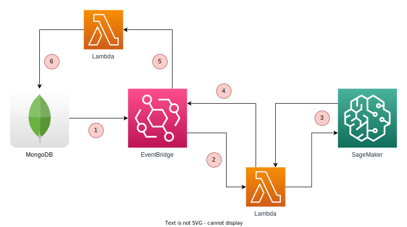

# QuickStart - MongoDB Atlas Analytics and Amazon SageMaker Integration

This quickstart helps you deploy MongoDB Atlas Cluster and Amazon SageMaker with other required AWS resources to quickly start working with your Machine Learning models with MongoDB as data source.

## Architecture Overview



1. Documents inserted into the MongoDB collection will be pushed to the EventBridge.
2. An Event Rule will be matched and a Lambda will be triggered.
3. Lambda processes the incoming events and uses the SageMaker endpoint to pass the data and get the results.
4. Results will be written back to the EventBridge.
5. An Event Rule will be matched for the result and a Lambda will be triggered.
6. Lambda writes results to the MongoDB.

## Prerequisites

- An AWS account with necessary permissions.
- (Optional) AWS CLI installed in your PC if AWS CLI is your preferred tool.
- A MongoDB account and a pair of MongoDB Cloud Public and Private API keys.
- An ECR image where inference code is stored and an S3 URL where the model artifacts, which result from model training, are stored.
- A Lambda ECR image to call SageMaker and get results.
- A Lambda ECR image to write results back to MongoDB.

## Setup MongoDB Atlas Cluster

Use `quickstart-atlas-cluster.yaml` file to setup the MongoDB Atlas Cluster using AWS CloudFormation.

Using AWS CLI:

```bash
aws cloudformation deploy --stack-name STACK_NAME --template-body quickstart-atlas-cluster.yaml
```

## Setup MongoDB Atlas App Services

Please check this [link](https://www.mongodb.com/docs/atlas/app-services/) to learn more about Atlas App Services.

You need an Atlas App Service to create triggers which respond to events like insert, update, read or delete on a collection.

Check the [Atlas App Services API (3.0)](https://www.mongodb.com/docs/atlas/app-services/admin/api/v3/) to create a Realm App and App Service.

Here are direct links to API documentation for creating an app and a service.

- [Get authentication tokens](https://www.mongodb.com/docs/atlas/app-services/admin/api/v3/#section/Get-Authentication-Tokens) (Use the access token as Bearer token in Authorization header in the further calls)
- [Create App](https://www.mongodb.com/docs/atlas/app-services/admin/api/v3/#tag/apps/operation/adminCreateApplication)
- [Create Service](https://www.mongodb.com/docs/atlas/app-services/admin/api/v3/#tag/services/operation/adminCreateService)

**Note**: Keep the App ID and Service ID handy for further steps.

## Setup EventBridge and SageMaker

Use `quickstart-mongodb-sagemaker.yaml` file to setup the Amazon SageMaker, EventBridge, Lambdas and MongoDB Trigger using AWS CloudFormation.

Please make necessary changes to Event rules according to your needs.

Using AWS CLI.

```bash
aws cloudformation deploy --stack-name STACK_NAME --template-body quickstart-mongodb-sagemaker.yaml
```
